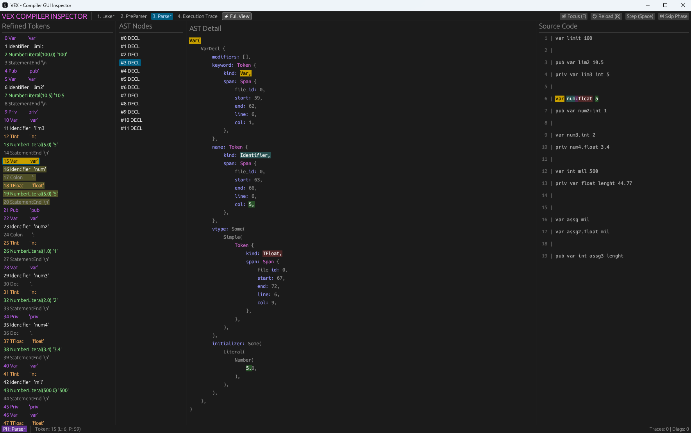

# Vex Inspector

Vex Inspector is a step-by-step visual debugger for the Vex compiler. It helps you see how your code is converted into tokens and AST nodes.

## Features

- **Step-by-Step Execution**: Advance the compiler one token or one declaration at a time.
- **Multiple Views**: Dedicated views for Lexer, PreParser, and Parser phases.
- **Full View**: See the entire compilation pipeline in one screen.
- **Execution Trace**: [TODO] Track the Rust function calls inside the parser to see how it processes your code.
- **Cross-Highlighting**: Click on a token to see its source location and its representation in different phases.
- **AST Detail**: View the structure of Abstract Syntax Tree nodes with syntax highlighting.

## Screenshot



## How to use

To run the inspector, you must use the `inspector` feature in the root project.

```bash
cargo run --features inspector -p vex-cli -- path/to/your_file.vx --inspect --gui
```

## Shortcuts

- **Space**: Next step.
- **Skip Phase**: Fast-forward to the next phase.
- **Reload (R)**: Restart the inspection from the beginning.
- **Focus (F)**: Scroll to the current selection.
- **Q**: Quit the application.
