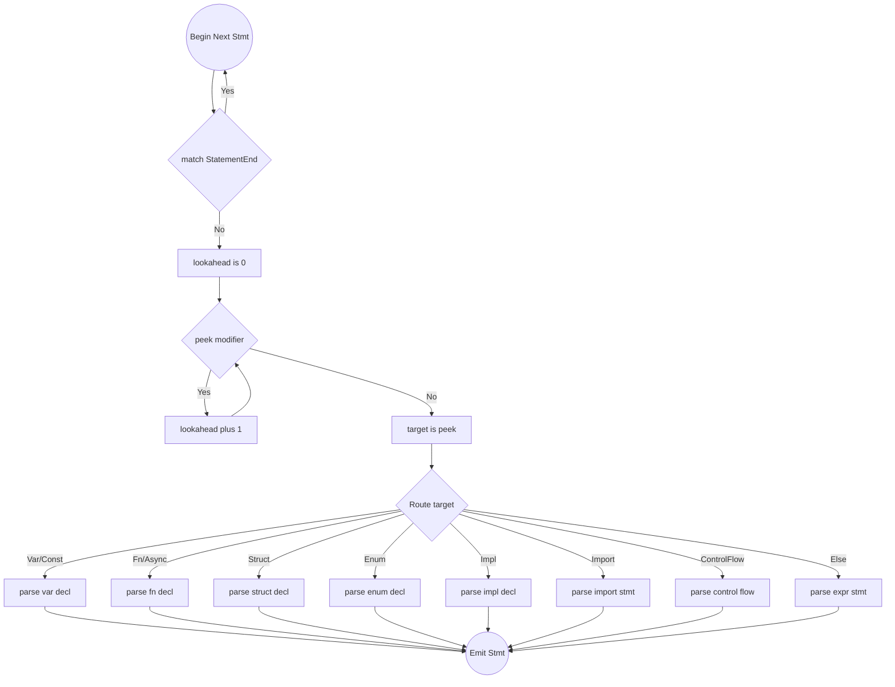

# Core Methods and Main Loop Algorithm

## Helper Functions

Before writing the actual parsing rules, ensure these token cursor helpers are available:

- `peek()`: Returns the current token without consuming it.
- `peek_at(offset)`: Looks ahead by `offset` tokens without consuming.
- `advance()`: Consumes the current token and moves to the next. Returns the consumed `Token`.
- `check(t)`: Returns `true` if `peek().kind == t`.
- `match_token(t)`: If `check(t)` is true, calls `advance()` and returns `true`. Otherwise returns `false`.
- `expect(t)`: If `match_token(t)` is true, returns. If false, constructs a diagnostic AST Error Node and triggers Panic/Recovery over the token stream.

## Flowchart: parse_declaration() Routing

## The Routing Algorithm Step-by-Step

1. Initialize `lookahead = 0`.
2. Loop `while peek_at(lookahead)` is `Pub`, `Static`, or `Priv`:
   - Increment `lookahead += 1`.
3. Evaluate the token at `peek_at(lookahead)`:
   - If `Var` or `Const` -> call `parse_var_decl()`
   - If `Async` or `Fn` -> call `parse_fn_decl()`
   - If `Struct` -> call `parse_struct_decl()`
   - If `Enum` -> call `parse_enum_decl()`
   - If `Import` -> call `parse_import_stmt()` (Note: modifiers shouldn't exist here, but routing works)
   - If `Impl` -> call `parse_impl_decl()`
   - If `Define` -> call `parse_define_decl()`
   - If `Macro` -> call `parse_macro_decl()`
   - If Control Flow Keywords (`If`, `While`, `For`, `Match`) -> call respective logic.
4. If NO matches, fallback to `parse_expr_statement()` (This handles variable assignments too).
5. **CRITICAL:** Inside the specific sub-parsers like `parse_fn_decl`, THEY must pop and collect the initial modifiers by using a `while match_token(Pub) || match_token(Static)...` loop before expecting their core keyword.
