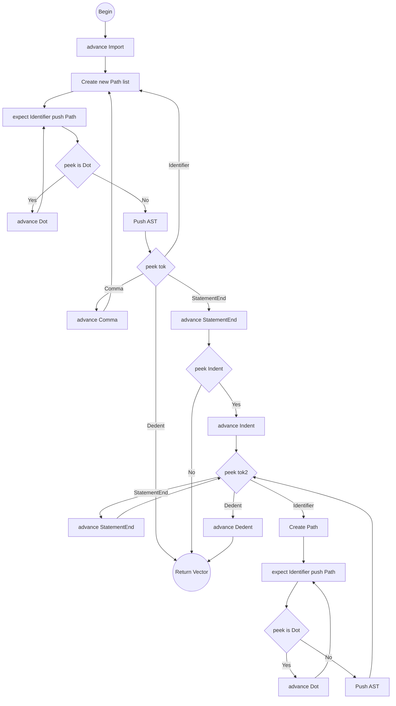

# Import Statement Algorithm

Target Node: `Stmt::Import { keyword: Token, path: Vec<Token> }`

## Flowchart Algorithm

## parse_import_stmt()

1. `keyword = advance()`.
2. Call `parse_single_import_path()`. Push returned `path` as `Stmt::Import`.
3. Loop `while check(TokenType::Identifier) || check(TokenType::Comma)`:
   - If `match_token(TokenType::Comma)`, consume it.
   - Call `parse_single_import_path()`. Push returned `path` as `Stmt::Import`.
4. Check for indented block:
   - If `peek() == StatementEnd` AND `peek_next() == Indent`:
     - `advance()` (Consume StatementEnd).
     - `advance()` (Consume Indent).
     - Loop `while !check(TokenType::Dedent)`:
       - If `match_token(TokenType::StatementEnd)`, continue.
       - Call `parse_single_import_path()`. Push as `Stmt::Import`.
     - `expect(TokenType::Dedent)`.

## parse_single_import_path()

1. Create `path = []`.
2. `expect(TokenType::Identifier)` -> Push to `path`.
3. Loop `while match_token(TokenType::Dot)`:
   - `expect(TokenType::Identifier)` -> Push to `path`.
4. Return `path` list.
