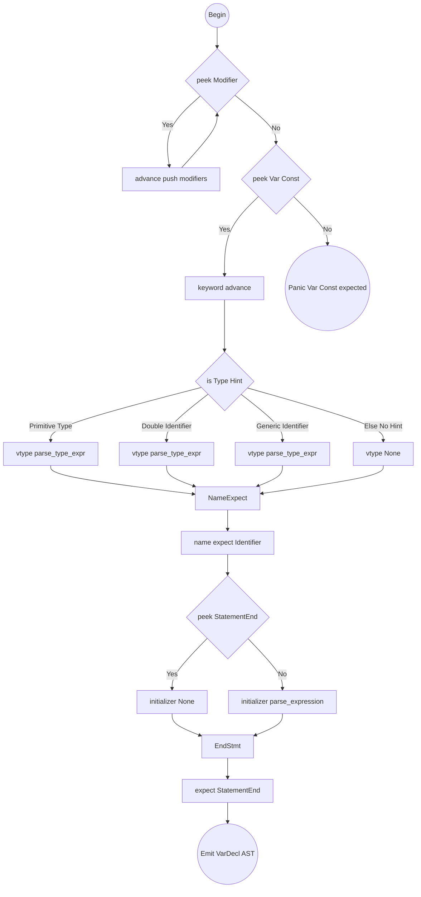

# Variable and Constant Declaration Algorithm

Target Node: `Stmt::VarDecl { modifiers, keyword, name, vtype, initializer }`

## Flowchart Algorithm

## parse_var_decl()

1. Initialize `modifiers = []`.
2. Loop `while match_token(Pub) || match_token(Static) || match_token(Priv)`:
   - Add consumed token to `modifiers`.
3. Keyword resolution:
   - If `match_token(Var)` or `match_token(Const)`, assign `keyword`. Else, trigger panic error.
4. Set `vtype = None`.
5. Optional Type Checking:
   - **RULE 1:** If `peek()` in primitive list (`TInt`, `TStr`, `TDict`...) -> `vtype = parse_type_expr()`.
   - **RULE 2:** If `peek() == Identifier` AND `peek_next() == Identifier` -> Identifier collision, first is explicitly a custom type (e.g. `var Server s`). `vtype = parse_type_expr()`.
   - **RULE 3:** If `peek() == Identifier` AND `peek_next() == LeftBracket` -> Generic type (e.g. `var Queue[str] x`). `vtype = parse_type_expr()`.
   - **RULE 4:** If `peek() == Fn` -> Callback/Function pointer hint (e.g. `var cb fn(int)`). `vtype = parse_type_expr()`.
6. Name resolution: `name = expect(TokenType::Identifier)`.
7. Initializer evaluation:
   - Set `initializer = None`.
   - If `!check(TokenType::StatementEnd)`:
     - `initializer = parse_expression(0)`.
8. `expect(TokenType::StatementEnd)`.
9. Return `Stmt::VarDecl { modifiers, keyword, name, vtype, initializer }`.

## Helper: parse_type_expr()

Target Node: `TypeExpr`

1. If `match_token` resolves primitive keyword (`TInt`, `TStr` etc.), return `TypeExpr::Primitive(keyword)`.
2. Function Reference (Callback type) hint: If `match_token(Fn)`:
   - `params = []`. Loop `while !check(Minus)`:
     - `params.push(parse_type_expr())`.
     - Allow optional commas `match_token(Comma)`.
   - `expect(Minus)`.
   - `ret_type = parse_type_expr()`.
   - Return `TypeExpr::Function(params, Box(ret_type))`.
3. Compute explicit struct/path bindings:
   - `name = expect(Identifier)`.
4. If `match_token(Dot)`:
   - Loop expecting `Identifier` and consuming `Dot` to parse `math.utils.Calculator` namespace tree. Return `TypeExpr::Path(list)`.
5. If `match_token(LeftBracket)`:
   - Collect items by calling `parse_type_expr()`, consuming `Comma` when present until `expect(RightBracket)`.
   - Return `TypeExpr::Generic(name, inner_types_list)`.
6. Fallback: Return `TypeExpr::Custom(name)`.
