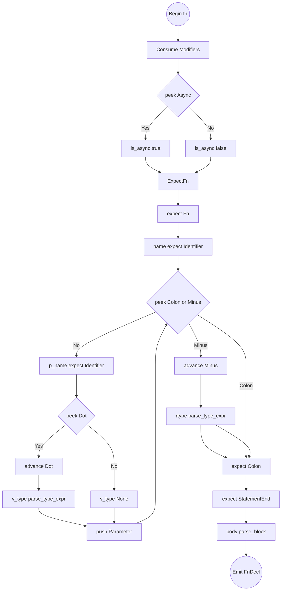
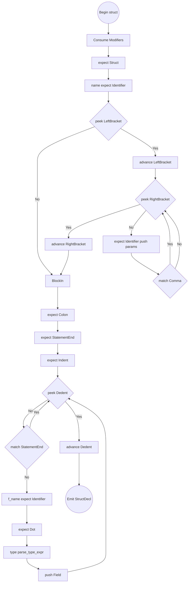
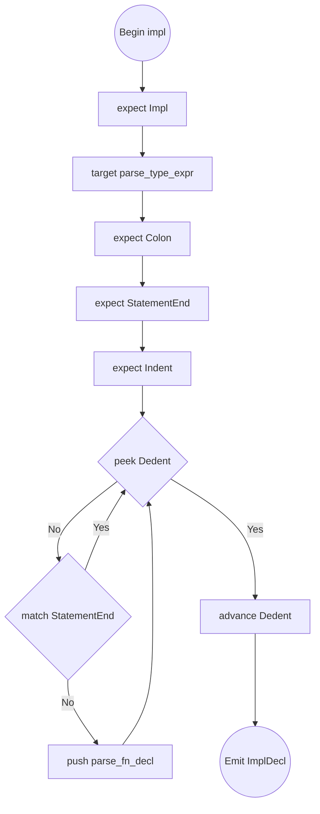

# Fn, Struct, and Impl Algorithms

## Flowchart: `parse_fn_decl()`

## parse_fn_decl()

1. Build `modifiers = []` (check/consume `Pub, Priv, Static`).
2. `is_async = match_token(Async)`.
3. `expect(Fn)`, `name = expect(Identifier)`.
4. Loop `while !check(Colon) && !check(Minus)`:
   - `param_name = expect(Identifier)`.
   - `var_type = None`. If `match_token(Dot)`, `var_type = parse_type_expr()`.
   - Push parameter to `params`.
5. Return Type: `rtype = None`. If `match_token(Minus)`, `rtype = parse_type_expr()`.
6. Enter block: `expect(Colon)`, `expect(StatementEnd)`.
7. `body = parse_block()`. Return `Stmt::FnDecl`.

## Flowchart: `parse_struct_decl()`

## parse_struct_decl()

1. Retrieve `modifiers`.
2. `expect(Struct)`, `name = expect(Identifier)`.
3. Generics: `type_params = []`. If `match_token(LeftBracket)`:
   - Loop `while !check(RightBracket)`:
     - Push `expect(Identifier)`.
     - `match_token(Comma)`.
   - `expect(RightBracket)`.
4. `expect(Colon)`, `expect(StatementEnd)`.
5. Enter block: `expect(Indent)`. Setup `fields = []`.
6. Loop `while !check(Dedent)`:
   - If `match_token(StatementEnd)`, continue.
   - `field_name = expect(Identifier)`, `expect(Dot)`, `field_type = parse_type_expr()`. Push to `fields`.
7. `expect(Dedent)`, return `Stmt::StructDecl`.

## Flowchart: `parse_impl_decl()`

## parse_impl_decl()

1. `expect(Impl)`.
2. `target = parse_type_expr()`.
3. Block entry: `expect(Colon)`, `expect(StatementEnd)`, `expect(Indent)`.
4. Setup `methods = []`.
5. Loop `while !check(Dedent)`:
   - If `match_token(StatementEnd)`, continue.
   - `methods.push(parse_fn_decl())`.
6. `expect(Dedent)`, return `Stmt::ImplDecl`.

## parse_block() helper

1. `expect(Indent)`. `stmts = []`.
2. Loop `while !check(Dedent) && !is_at_end()`:
   - If `match_token(StatementEnd)`, continue.
   - `stmts.push(parse_declaration())`.
3. `expect(Dedent)`. Return `stmts`.
