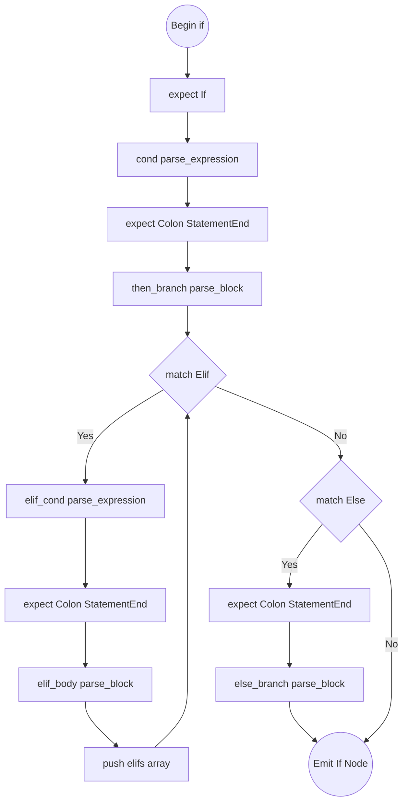
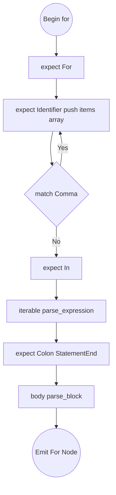
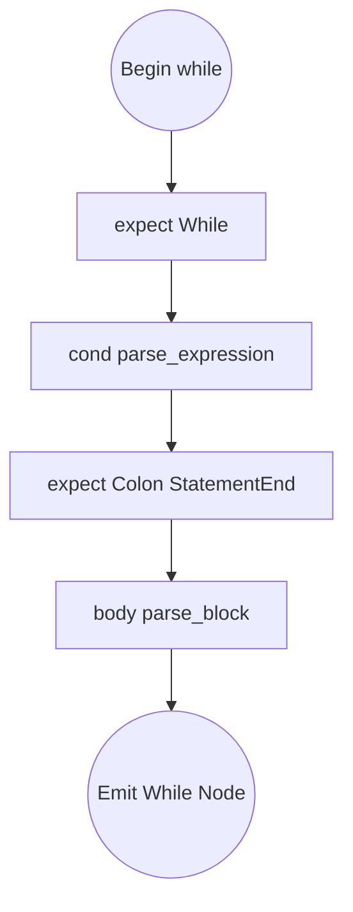
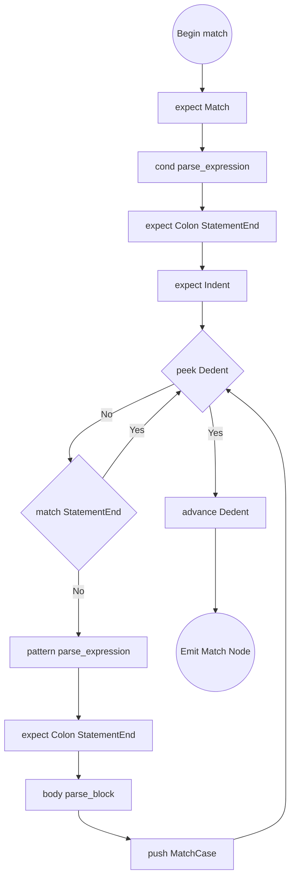

# Control Flow Algorithms

Target Nodes: `Stmt::If`, `Stmt::While`, `Stmt::For`, `Stmt::Match`

## Flowchart: `parse_if_stmt()`

## parse_if_stmt()

1. `expect(If)`, `condition = parse_expression(0)`.
2. `expect(Colon)`, `expect(StatementEnd)`.
3. `then_branch = parse_block()`.
4. `elifs = []`. Loop `while match_token(Elif)`:
   - `elif_cond = parse_expression(0)`.
   - `expect(Colon)`, `expect(StatementEnd)`, `elif_body = parse_block()`.
   - Push `(elif_cond, elif_body)` to `elifs`.
5. `else_branch = None`. If `match_token(Else)`:
   - `expect(Colon)`, `expect(StatementEnd)`, `else_branch = Some(parse_block())`.
6. Return node.

## Flowchart: `parse_for_stmt()`

## parse_for_stmt()

1. `expect(For)`. `items = []`.
2. Loop:
   - Push `expect(Identifier)`.
   - If `!match_token(Comma)`, break loop.
3. `expect(In)`, `iterable = parse_expression(0)`.
4. `expect(Colon)`, `expect(StatementEnd)`.
5. `body = parse_block()`. Return node.

## Flowchart: `parse_while_stmt()`

## parse_while_stmt()

1. `expect(While)`, `condition = parse_expression(0)`.
2. `expect(Colon)`, `expect(StatementEnd)`.
3. `body = parse_block()`. Return node.

## Flowchart: `parse_match_stmt()`

## parse_match_stmt()

1. `expect(Match)`, `condition = parse_expression(0)`.
2. `expect(Colon)`, `expect(StatementEnd)`, `expect(Indent)`. Setup `cases = []`.
3. Loop `while !check(Dedent)`:
   - If `match_token(StatementEnd)`, continue.
   - `pattern = parse_expression(0)`.
   - `expect(Colon)`, `expect(StatementEnd)`.
   - `case_body = parse_block()`. Push `MatchCase { pattern, body: case_body }`.
4. `expect(Dedent)`, return node.
