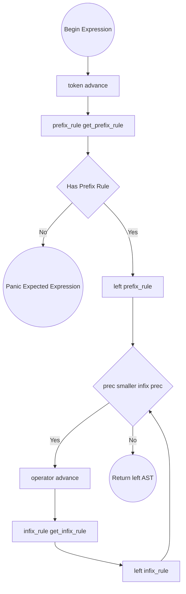

# Pratt Parser: Expression Algorithms

## Flowchart: `parse_expression(precedence)`

## Essential Prefix Rules (Starting Expressions)

### 1. Primitives (Number, String, Boolean, Null)

- Return `Expr::Literal { value: token.value }`.

### 2. Identifiers (Variables)

- Return `Expr::Variable { name: token }`.

### 3. F-Strings (`FStringStart`)

1. Setup `parts = []`.
2. Loop `while !match_token(FStringEnd) && !is_at_end()`:
   - If `check(FStringContent)` -> `parts.push(Expr::Literal(advance()))`.
   - If `match_token(OpenInterpolation)` -> `parts.push(parse_expression(0))`, then `expect(CloseInterpolation)`.
3. Return `Expr::FString(parts)`.

### 4. Lists (`LeftBracket`)

1. Setup `elements = []`.
2. Loop `while !check(RightBracket)`:
   - `elements.push(parse_expression(0))`.
   - If `!match_token(Comma)`, `break`.
3. `expect(RightBracket)`.
4. Return `Expr::List { elements }`.

### 5. Dictionaries (`LeftBrace`)

1. Setup `entries = []`.
2. Loop `while !check(RightBrace)`:
   - `key = parse_expression(0)`.
   - `expect(Colon)`.
   - `val = parse_expression(0)`.
   - `entries.push((key, val))`.
   - If `!match_token(Comma)`, `break`.
3. `expect(RightBrace)`.
4. Return `Expr::Dict { entries }`.

### 6. Grouping (`LeftParen`)

1. `inner = parse_expression(0)`.
2. `expect(RightParen)`.
3. Return `Expr::Grouping(Box(inner))`.

### 7. Unary Operators (`Bang`, `Minus`)

1. `operator = token`.
2. `right = parse_expression(PREFIX_PRECEDENCE)`.
3. Return `Expr::Unary { operator, right: Box(right) }`.

### 8. Async Await (`Await`)

1. `keyword = token` (`await`).
2. `value = parse_expression(PREFIX_PRECEDENCE)`.
3. Return `Expr::Await { keyword, value: Box(value) }`.

### 9. Closures & Lambdas (`Fn` Token prefix)

1. Setup `params = []`.
2. Loop `while !check(Colon) && !check(Minus)`:
   - `name = expect(Identifier)`.
   - `var_type = None`. If `match_token(Dot)` -> `var_type = parse_type_expr()`.
   - `params.push(Parameter { name, var_type })`.
3. `rtype = None`. If `match_token(Minus)` -> `rtype = parse_type_expr()`.
4. `expect(Colon)`, `expect(StatementEnd)`.
5. `body = parse_block()`.
6. Return `Expr::Closure { params, rtype, body: Box(Stmt::Block(body)) }`.

---

## Essential Infix Rules (Connecting Expressions)

### 1. Mathematical Operations (`+`, `-`, `*`, `/`, `==`, `<`, `as`, `!=`, `>`, `<=`, `>=`)

1. `operator = token`.
2. `right = parse_expression(get_infix_precedence(operator.kind))`.
3. Return `Expr::Binary { left: Box(left), operator, right: Box(right) }`.

### 2. Logical Operations (`and`, `or`, `&&`, `||`)

1. `operator = token`.
2. `right = parse_expression(get_infix_precedence(operator.kind))`.
3. Return `Expr::Logical { left: Box(left), operator, right: Box(right) }`.

### 3. Vex Function Call (Triggered by any adjacent Prefix Token)

_(Vex functions do NOT use parentheses, so any prefix-yielding token directly acts as an infix trigger)_

1. Input: `callee = left` (e.g., `print`).
2. Setup `arguments = []`.
3. Loop `while peek().kind_has_prefix_rule() && !check(StatementEnd)`:
   - `arguments.push(parse_expression(CALL_PRECEDENCE))`.
     _(CALL_PRECEDENCE should be very high, e.g., 14)_
4. Return `Expr::Call { callee: Box(callee), arguments, closing_paren: (virtual or placeholder token) }`.

### 4. Struct Instantiation (`LeftBrace` acting as infix to Identifier)

Example: `User { limit: 10 }`

1. Input: `name_obj = left`. Extract identifier token: `name = name_obj.token`.
2. Setup `fields = []`.
3. Loop `while !check(RightBrace)`:
   - `field_name = expect(Identifier)`.
   - `expect(Colon)`.
   - `val = parse_expression(0)`.
   - `fields.push((field_name, val))`.
   - `match_token(Comma)`.
4. `expect(RightBrace)`.
5. Return `Expr::StructInit { name, fields }`.

### 5. Get / Array Index / Safe Navigation (`Dot`, `DynamicDot`, `SafeDot`, `SafeDynamicDot`)

1. Input: `object = left`.
2. If `operator == Dot` OR `SafeDot`:
   - `name = expect(Identifier)`.
   - Return `Expr::Get { object: Box(object), name, is_safe: (operator == SafeDot) }`.
3. If `operator == DynamicDot` OR `SafeDynamicDot`:
   - `index = parse_expression(MAX_PRECEDENCE)`.
   - Return `Expr::Index { object: Box(object), index: Box(index), closing_bracket: (virtual token), is_safe: (operator == SafeDynamicDot) }`.

### 6. Try / Error Propagation (`Question`)

_(Handles Rust-style `res?`)_
_(Currently, this is missing from ast.rs, but Pratt needs to handle it if requested. Assuming it will be mapped to a unary/function or ignored if absent)_

### 7. Assignment (`Eq`, `PlusEq`, `MinusEq`, `StarEq`, `SlashEq`)

_(In Vex, assignment is treated as an expression node)_

1. Input: `target = left`.
2. `operator = token`.
3. `value = parse_expression(ASSIGN_PRECEDENCE)`.
4. Return `Expr::Assign { target: Box(target), operator, value: Box(value) }`.

---

## Assignment Without Equals (In Statement Parser)

_(Triggered ONLY at the base statement level via `parse_expr_statement()`)_

1. `target_ast = parse_expression(0)`.
2. If `!check(StatementEnd)` AND next token initiates an expression AND target_ast is an Identifier/Get/Index:
   - E.g: `limit 10`
   - `value_ast = parse_expression(0)`.
   - Build `Expr::Assign { target: Box(target_ast), operator: Virtual Eq, value: Box(value_ast) }`.
3. Shorthand Assignment (`++`, `--`):
   - If `peek()` is `PlusPlus` or `MinusMinus`, `operator = advance()`, build `Expr::Assign { value: Virtual Number(1) }`.
4. `expect(StatementEnd)`, wrap in `Stmt::Expression`, return.
