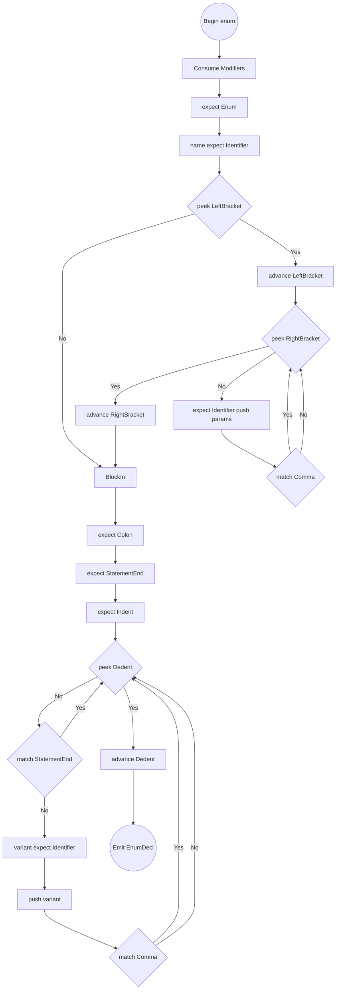
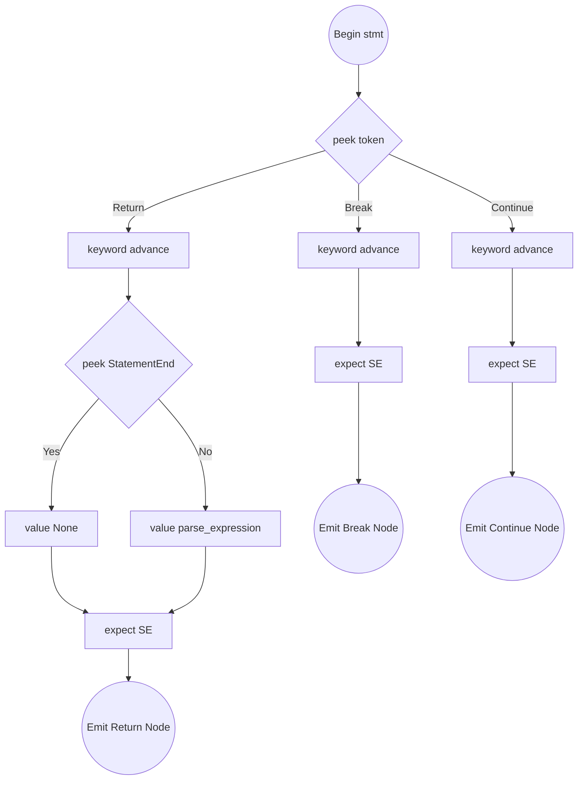

# Enums, Macros, and Miscellaneous Statements

Target Nodes: `Stmt::EnumDecl`, `Stmt::MacroDecl`, `Stmt::DefineDecl`, `Stmt::Return`, `Stmt::Break`, `Stmt::Continue`

## Flowchart: `parse_enum_decl()`

## parse_enum_decl()

1. Retrieve `modifiers` (from routing lookahead).
2. `expect(Enum)`, `name = expect(Identifier)`.
3. Generics: `type_params = []`. If `match_token(LeftBracket)`:
   - Loop `while !check(RightBracket)`:
     - `type_params.push(expect(Identifier))`.
     - `match_token(Comma)`.
   - `expect(RightBracket)`.
4. Block Entry: `expect(Colon)`, `expect(StatementEnd)`, `expect(Indent)`.
5. Setup `variants = []`.
6. Loop `while !check(Dedent)`:
   - If `match_token(StatementEnd)`, continue.
   - `variants.push(expect(Identifier))`.
   - `match_token(Comma)` (allow optional commas between variants).
7. `expect(Dedent)`, return `Stmt::EnumDecl`.

---

## parse_define_decl()

_(Defines act as lightweight consts, e.g., `define PI 3.14`)_

1. `expect(Define)`.
2. `name = expect(Identifier)`.
3. `value = parse_expression(0)`.
4. `expect(StatementEnd)`.
5. Return `Stmt::DefineDecl`.

---

## parse_macro_decl()

_(Macros act as code-generation blocks, e.g., `macro loop count:`)_

1. `expect(Macro)`.
2. `name = expect(Identifier)`.
3. Setup `params = []`. Loop `while !check(Colon)`:
   - `params.push(expect(Identifier))`.
4. `expect(Colon)`, `expect(StatementEnd)`.
5. `body = parse_block()`.
6. Return `Stmt::MacroDecl`.

---

## Flowchart: Jump Statements

## Statement Parses routines

### parse_return_stmt()

1. `keyword = advance()`.
2. If `!check(StatementEnd)` -> `value = Some(parse_expression(0))`.
3. Else -> `value = None`.
4. `expect(StatementEnd)`. Return `Stmt::Return`.

### parse_break_stmt()

1. `keyword = advance()`.
2. `expect(StatementEnd)`. Return `Stmt::Break`.

### parse_continue_stmt()

1. `keyword = advance()`.
2. `expect(StatementEnd)`. Return `Stmt::Continue`.
