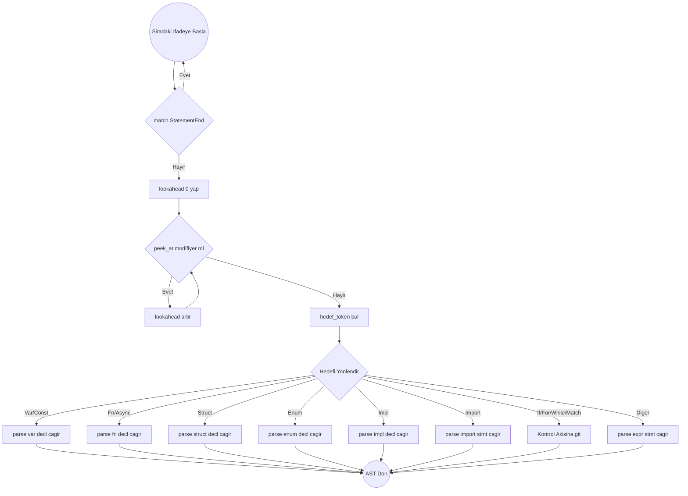

# Temel Metotlar ve Ana Döngü Algoritması

## Yardımcı Fonksiyonlar (Helpers)

Bir koda başlarken `Cursor` ve `Tokens` üzerinde gezinecek bu yardımcıları kurun:

- `peek()`: Mevcut tokeni tüketmeden döndürür.
- `peek_at(offset)`: Mevcut tokenden `offset` kadar sonrakini tüketmeden döndürür.
- `advance()`: Mevcut tokeni tüketir ve bir sonrakine geçer. `Token` döner.
- `check(t)`: `peek().kind == t` ise `true` döner.
- `match_token(t)`: `check(t)` true ise `advance()` çağırır ve `true` döner. Değilse `false` döner.
- `expect(t)`: `match_token(t)` true dönerse çıkar. False ise AST'ye hata düğümü (Error Node) basar ve Panic/Recovery başlatır.

## Ayrıştırma Şeması: parse_declaration() Yönlendirmesi

## Yönlendirme Algoritması (Adım Adım)

1. `lookahead = 0` başlat.
2. Döngü: `peek_at(lookahead)` `Pub`, `Static` veya `Priv` olduğu sürece:
   - `lookahead += 1` yap.
3. Bulunan asıl tokeni (`peek_at(lookahead)`) incele:
   - `Var` veya `Const` ise -> `parse_var_decl()`
   - `Async` veya `Fn` ise -> `parse_fn_decl()`
   - `Struct` ise -> `parse_struct_decl()`
   - `Enum` ise -> `parse_enum_decl()`
   - `Import` ise -> `parse_import_stmt()`
   - `Impl` ise -> `parse_impl_decl()`
   - Eğer hiçbiri değilse, her zaman en genel ifade toplayıcı olan `parse_expr_statement()` fonksiyonuna (Matematik ve Atamalar) düşür.
4. **KRİTİK NOT:** `parse_fn_decl` veya `parse_var_decl` gibi özelleştirilmiş alt-ayrıştırıcıların her biri, işe başladıklarında önce başlarındaki o ayırıcı kelimeleri (`pub`, `static` vs.) yutmak zorundadır (örn: `while match_token(Pub)...`).
