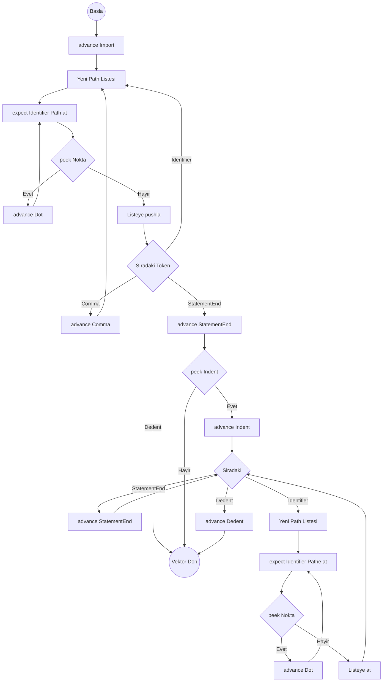

# Import İfadesi Algoritması

Hedef Düğüm: `Stmt::Import { keyword: Token, path: Vec<Token> }`

## Ayrıştırma Şeması (Flowchart)

## parse_import_stmt()

1. `keyword = advance()` (Import tokenini yut).
2. `parse_single_import_path()` çağır. Dönen `path` objesini `Stmt::Import` olarak ekle.
3. Alt satıra inene kadar topla:
   - Döngü: `while check(TokenType::Identifier) || check(TokenType::Comma)`
     - Eğer `match_token(TokenType::Comma)` ise yut.
     - `parse_single_import_path()` çağır ve yeni `Stmt::Import` ekle.
4. Alt satır blok kontrolü (Indent):
   - Eğer `peek() == StatementEnd` VE `peek_next() == Indent` ise:
     - `advance()` (StatementEnd yut), `advance()` (Indent yut).
     - Döngü: `while !check(TokenType::Dedent)`
       - Eğer `match_token(TokenType::StatementEnd)` ise atla (continue).
       - `parse_single_import_path()` çağır ve listeye ekle.
     - `expect(TokenType::Dedent)`.
5. Bitti.

## parse_single_import_path()

1. Boş `path = []` oluştur.
2. `expect(TokenType::Identifier)` çağır ve `path` içine pushla.
3. Döngü: `while match_token(TokenType::Dot)`
   - `expect(TokenType::Identifier)` çağır ve pushla.
4. `path` dizisini döndür.
