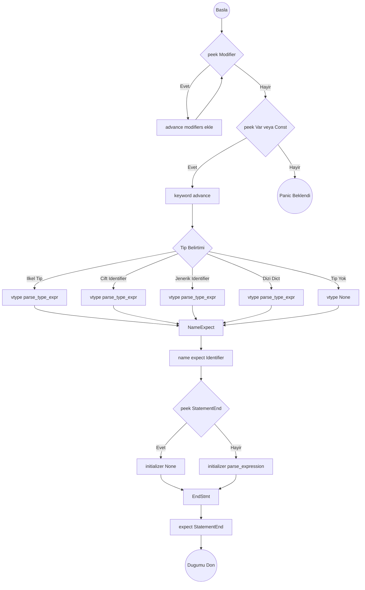

# Değişken ve Sabit Tanımlama Ayrıştırma Algoritması

Hedef Düğüm: `Stmt::VarDecl { modifiers, keyword, name, vtype, initializer }`

## Ayrıştırma Şeması (Flowchart)

## parse_var_decl()

1. Boş `modifiers = []` oluştur.
2. Döngü: `while match_token(Pub) || match_token(Static) || match_token(Priv)`:
   - Yutulan tokeni `modifiers` içine ekle.
3. Beklenen Keyword Tüketimi:
   - Eğer `match_token(Var)` veya `match_token(Const)` geçerliyse yutulan tokeni `keyword` olarak ata, değilse Panic fırlat.
4. Başlangıçta `vtype = None`.
5. Opsiyonel Tip Belirlemeyi (Type Hint) Oku:
   - **KURAL 1:** Eğer `peek()` türü ilkel bir tip kelimesiyse (`TInt, TStr, TBool, TFloat, TList, TDict...`) -> `vtype = parse_type_expr()`.
   - **KURAL 2:** Eğer `peek() == Identifier` VE `peek_next() == Identifier` ise (örn: `var Server s`) -> İlk Identifier kesinlikle özel tiptir. `vtype = parse_type_expr()`.
   - **KURAL 3:** Eğer `peek() == Identifier` VE `peek_next() == LeftBracket` ise (örn: `var Queue[str] q`) -> Jenerik özel tiptir. `vtype = parse_type_expr()`.
   - **KURAL 4:** Eğer `peek() == Fn` ise (örn: `var f fn(int) - str`) -> Callback tiptir. `vtype = parse_type_expr()`.
6. İsim Çıkarımı: `name = expect(TokenType::Identifier)` çağır ve kaydet. (Aksi halde ismi parse etmeyi başaramazsan panic yolla).
7. İnitializer (Başlangıç Değeri) Oku:
   - `initializer = None` yap.
   - Eğer `!check(TokenType::StatementEnd)` ise (devamında ifade varsa):
     - `initializer = parse_expression(0)` (Başlangıç değerini matematiksel ifadeye dök).
8. Cümleyi Sonlandır: `expect(TokenType::StatementEnd)` çağır.
9. Elde edilen değerlerle `Stmt::VarDecl { modifiers, keyword, name, vtype, initializer }` döndür.

## Yardımcı Metot: parse_type_expr()

Hedef Düğüm: `TypeExpr`

Bu metot sadece statik tip çıkarımları için çağırılır (örn: `str`, `system.net.Client`, `Queue[T]`, `fn(int) - bool`).

1. Eğer `match_token(TInt)`, `match_token(TStr)`... (Primitive tipler) başarılıysa -> `TypeExpr::Primitive(o_keyword)` dön.
2. Callback Tipi (Fonksiyon Referansı): Eğer `match_token(Fn)` ise:
   - `params = []`. Döngü: `while !check(Minus)` (veya Return oku `->` vs. görene kadar):
     - `params.push(parse_type_expr())`. Opsiyonel virgülleri yut: `match_token(Comma)`.
   - `expect(Minus)` (VEYA `unify` ile `->` kabul edilebilir ise) yut.
   - `ret_type = parse_type_expr()`. `TypeExpr::Function(params, Box(ret_type))` dön.
3. `name = expect(Identifier)` işlemi ile hedef kelimeyi yut.
4. Eğer `match_token(Dot)` gelirse (Path Tipi):
   - Döngü: Sürekli `expect(Identifier)` yap, eğer arkasından nokta `match_token(Dot)` veriyorsa listeye eklemeye devam et. En son bittiğinde `TypeExpr::Path(yol_listesi)` dön.
5. Eğer `match_token(LeftBracket)` gelirse (Generic Tip):
   - Element listesi = `[]`.
   - Döngü: `while !check(RightBracket)`
     - İçeri de `TypeExpr` taşıyacağı için `parse_type_expr()` çağırarak içeriği yut.
     - `match_token(Comma)` varsa devam.
   - `expect(RightBracket)`. `TypeExpr::Generic(name, element_listesi)` dön.
6. Bunların hiçbiri yoksa -> `TypeExpr::Custom(name)` dön.
