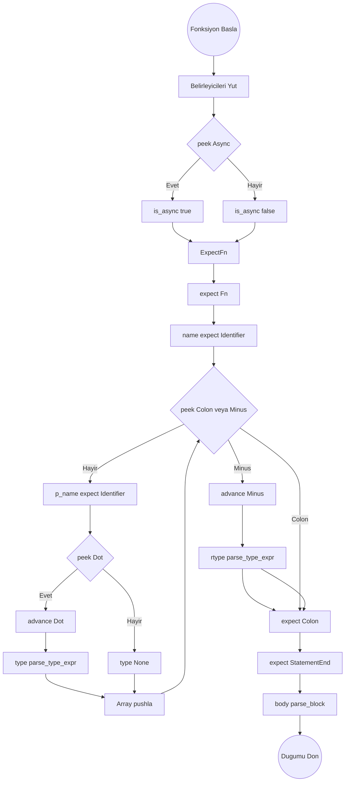
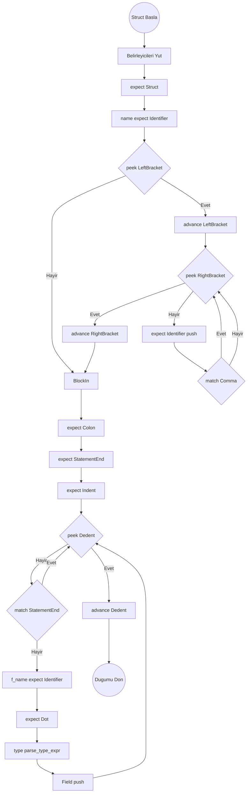
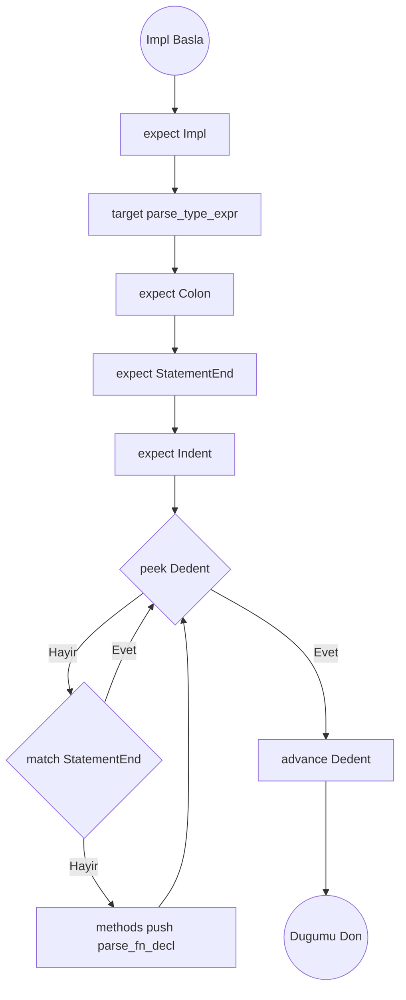

# Fn, Struct ve Impl Blokları Algoritmaları

## Ayrıştırma Şeması: `parse_fn_decl()`

## parse_fn_decl()

1. `modifiers = []` oluştur. `Pub`, `Priv`, `Static` tokenlerini döngü ile kontrol edip ekle.
2. `is_async = match_token(Async)` ile yakala.
3. `expect(Fn)` yut. `name = expect(Identifier)` yut.
4. Parametreleri (params) topla:
   - `params = []` oluştur.
   - Döngü: `while !check(Colon) && !check(Minus)`
     - `param_name = expect(Identifier)` yut.
     - `var_type = None` yap, eğer `match_token(Dot)` gelirse `var_type = parse_type_expr()`.
     - `params.push(Parameter { name, var_type })`.
5. Dönüş Tipi: `rtype = None`. Eğer `match_token(Minus)` ise `rtype = parse_type_expr()`.
6. Blok girişini yut: `expect(Colon)` ve `expect(StatementEnd)`.
7. `body = parse_block()`. `Stmt::FnDecl` objesini döndür.

## Ayrıştırma Şeması: `parse_struct_decl()`

## parse_struct_decl()

1. `modifiers` topla.
2. `expect(Struct)` yut. `name = expect(Identifier)` yut.
3. Jenerikler: `type_params = []`. Eğer `match_token(LeftBracket)` (yani `[`) gelirse:
   - Döngü: `while !check(RightBracket)`
     - `type_params.push(expect(Identifier))`.
     - `match_token(Comma)`.
   - `expect(RightBracket)` (yani `]`) yut.
4. Blok girişini yut: `expect(Colon)` ve `expect(StatementEnd)`.
5. İçeri Gir: `expect(Indent)`. `fields = []` oluştur.
6. Döngü: `while !check(Dedent)`:
   - Eğer `match_token(StatementEnd)` ise atla (continue).
   - `field_name = expect(Identifier)` yut, `expect(Dot)`, `field_type = parse_type_expr()`. Listeye ekle.
7. `expect(Dedent)`, `Stmt::StructDecl` döndür.

## Ayrıştırma Şeması: `parse_impl_decl()`

## parse_impl_decl()

1. `expect(Impl)` yut.
2. `target = parse_type_expr()` (Bağlanacağı hedef tip).
3. `expect(Colon)`, `expect(StatementEnd)` ve `expect(Indent)` yut.
4. `methods = []` başlat.
5. Döngü: `while !check(Dedent)`:
   - Eğer `match_token(StatementEnd)` ise atla (continue).
   - `methods.push(parse_fn_decl())`.
6. `expect(Dedent)`, `Stmt::ImplDecl` döndür.

## Standart Blok Okuyucu Algoritması `parse_block()`

1. `expect(Indent)`. `stmts = []`.
2. Döngü: `while !check(Dedent) && !is_at_end()`
   - Eğer `match_token(StatementEnd)` ise continue.
   - `stmts.push(parse_declaration())`.
3. `expect(Dedent)`. `stmts` dizisini döndür.
