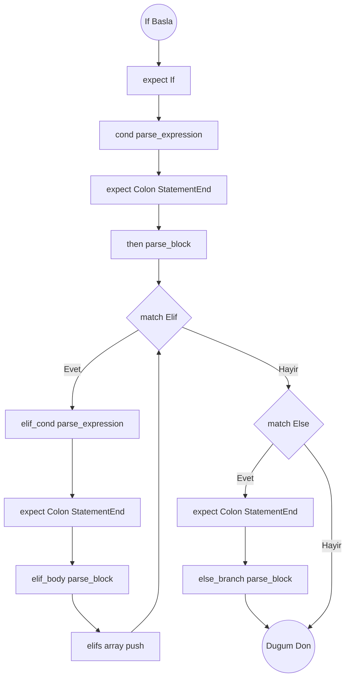
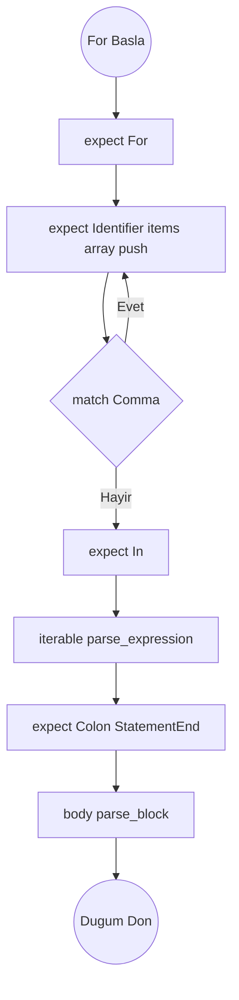
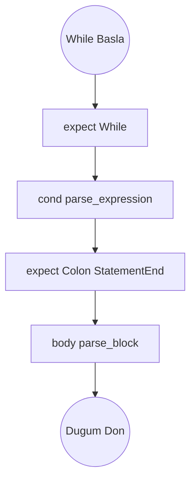
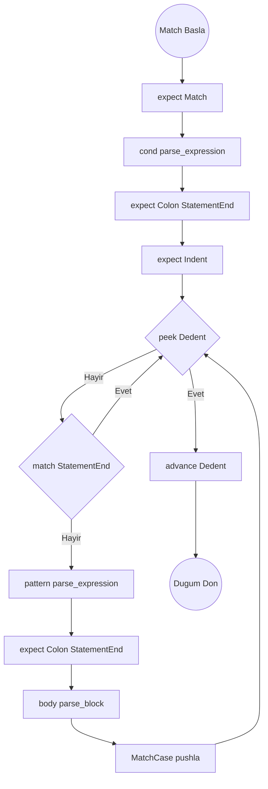

# Kontrol Akışı Ayrıştırma Algoritmaları

Hedef Düğümler: `Stmt::If`, `Stmt::While`, `Stmt::For`, `Stmt::Match`

## Ayrıştırma Şeması: `parse_if_stmt()`

## parse_if_stmt()

1. `expect(If)` yut. `condition = parse_expression(0)` (Koşulu çek).
2. `expect(Colon)` ve `expect(StatementEnd)` yut.
3. `then_branch = parse_block()` (Ana if gövdesini çek).
4. `elifs = []` oluştur. Döngü: `while match_token(Elif)`:
   - `elif_cond = parse_expression(0)`.
   - `expect(Colon)` ve `expect(StatementEnd)`. `elif_body = parse_block()`.
   - `elifs.push((elif_cond, elif_body))`.
5. `else_branch = None` başlat. Eğer `match_token(Else)` doğruysa:
   - `expect(Colon)` ve `expect(StatementEnd)`. `else_branch = Some(parse_block())`.
6. Düğümü döndür.

## Ayrıştırma Şeması: `parse_for_stmt()`

## parse_for_stmt()

1. `expect(For)` yut. Öğe listesi: `items = []`.
2. Döngü:
   - `items.push(expect(Identifier))`.
   - Eğer `!match_token(Comma)` dönüyorsa döngüyü `break` ile kır.
3. `expect(In)` yut. `iterable = parse_expression(0)` (Üzerinde gezilen listeyi al).
4. `expect(Colon)` ve `expect(StatementEnd)`.
5. `body = parse_block()`. Düğümü döndür.

## Ayrıştırma Şeması: `parse_while_stmt()`

## parse_while_stmt()

1. `expect(While)` yut. `condition = parse_expression(0)`.
2. `expect(Colon)` ve `expect(StatementEnd)`.
3. `body = parse_block()`. Düğümü döndür.

## Ayrıştırma Şeması: `parse_match_stmt()`

## parse_match_stmt()

1. `expect(Match)` yut. `condition = parse_expression(0)`.
2. `expect(Colon)`, `expect(StatementEnd)`, `expect(Indent)`. `cases = []` başlat.
3. Döngü: `while !check(Dedent)`:
   - Eğer `match_token(StatementEnd)` ise continue.
   - `pattern = parse_expression(0)` (case deseni: örn 'Ok(req)').
   - `expect(Colon)` ve `expect(StatementEnd)`.
   - `case_body = parse_block()`. `MatchCase { pattern, body: case_body }` yapıp listeye at.
4. `expect(Dedent)`, düğümü döndür.
