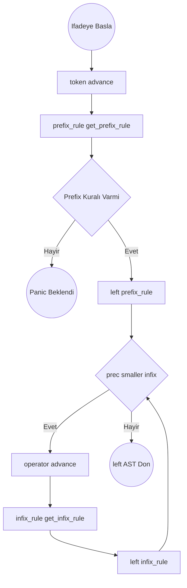

# Pratt Parser: Expression (İfade) Algoritmaları

## Ayrıştırma Şeması: `parse_expression(precedence)`

## Önemli Prefix (Önek/Başlatıcı) Kuralları

### 1. Primitive Veriler (Sayı, Metin, Boolean, Null)

- Gelen değeri tut ve `Expr::Literal(value)` dön.

### 2. Identifier (Değişken İsimleri)

- `Expr::Variable { name: token }` dön.

### 3. F-String'ler (`FStringStart`)

1. `parts = []` dizisini temizle.
2. Döngü: `while !match_token(FStringEnd) && !is_at_end()`
   - Eğer `check(FStringContent)` ise -> içeriği yut ve `Expr::Literal` olarak `parts`'a ekle.
   - Eğer `match_token(OpenInterpolation)` (yani `{`) ise:
     - İçeriyi parse et: `parts.push(parse_expression(0))`.
     - Sonra parantezi kapat: `expect(CloseInterpolation)`.
3. Düğümü dön: `Expr::FString(parts)`.

### 4. Listeler (`LeftBracket` veya `[`)

1. `elements = []` oluştur.
2. Döngü: `while !check(RightBracket)`
   - Yeni eleman okut: `elements.push(parse_expression(0))`.
   - Eğer `!match_token(Comma)` (virgül yoksa) -> döngüyü `break` ile kır.
3. `expect(RightBracket)` yut. Tipi dön: `Expr::List { elements }`.

### 5. Sözlükler (Dict) (`LeftBrace` veya `{`)

1. `entries = []` oluştur.
2. Döngü: `while !check(RightBrace)`
   - `key = parse_expression(0)`.
   - `expect(Colon)` yut.
   - `val = parse_expression(0)`.
   - `entries.push((key, val))`.
   - Eğer `!match_token(Comma)` -> `break`.
3. `expect(RightBrace)` yut. Tipi dön: `Expr::Dict { entries }`.

### 6. Parantez İçi Gruplama (`LeftParen`)

1. İçeriyi oku: `inner = parse_expression(0)`.
2. Kapat: `expect(RightParen)`.
3. Tipi dön: `Expr::Grouping(Box(inner))`.

### 7. Tekil (Unary) Operatörler (`Bang (!)` ve `Minus (-)`)

1. `operator = token`.
2. Sahipleneceği sağ nesneyi oku: `right = parse_expression(PREFIX_PRECEDENCE)`.
3. Tipi dön: `Expr::Unary { operator, right: Box(right) }`.

### 8. Async Bekleme (`Await`)

1. `keyword = token` (`await`).
2. Sağdaki ifadeyi yut: `value = parse_expression(PREFIX_PRECEDENCE)`.
3. Dön: `Expr::Await { keyword, value: Box(value) }`.

### 9. Anonim Fonksiyonlar (Closure/Lambda - `Fn` Tokeni Başlatır)

1. Parametreleri tut: `params = []`.
2. Döngü: `while !check(Colon) && !check(Minus)` (Dönüş tipine veya bloğa kadar):
   - `name = expect(Identifier)`.
   - Opsiyonel Tip: Eğer `match_token(Dot)` ise `var_type = Some(parse_type_expr())`. Aksi halde None.
   - `params.push(Parameter { name, var_type })`.
3. Dönüş Tipi: `rtype = None`. Eğer `match_token(Minus)` ise `rtype = Some(parse_type_expr())`.
4. `expect(Colon)` ve `expect(StatementEnd)`.
5. Gövdeyi okut: `body = parse_block()`.
6. Dön: `Expr::Closure { params, rtype, body: Box(Stmt::Block(body)) }`.

---

## Önemli Infix (İçrek/Birleştirici) Kuralları

### 1. Matematiksel İşlemler (`+`, `-`, `*`, `/`, `==`, `<`, `as`, `!=`, `>`, `<=`, `>=`)

1. `operator = token`.
2. Sağ tarafı kap: `right = parse_expression(get_infix_precedence(operator.kind))`.
3. Tipi dön: `Expr::Binary { left: Box(left), operator, right: Box(right) }`.

### 2. Mantıksal İşlemler (Logical: `and`, `or`, `&&`, `||`)

_(Tek farkı AST modelinde Binary değil Logical olarak işaretlenmesidir)_

1. `operator = token`.
2. Sağ tarafı kap: `right = parse_expression(get_infix_precedence(operator.kind))`.
3. Tipi dön: `Expr::Logical { left: Box(left), operator, right: Box(right) }`.

### 3. Vex Fonksiyon Çağrısı (Prefix kelimeler yan yanaysa tetiklenir)

_(Vex fonksiyonları parantez `()` almaz! O yüzden araya giren boşluklar Infix yapar.)_

1. Girdi: `callee = left` (yani `print`).
2. `arguments = []` oluştur.
3. Döngü: `while peek().kind_has_prefix_rule() && !check(StatementEnd)`
   - Yanındaki argümanı bağla: `arguments.push(parse_expression(CALL_PRECEDENCE))`.
4. Tipi dön: `Expr::Call { callee: Box(callee), arguments, closing_paren: sanal_token_veya_span }`.

### 4. Struct Oluşturma / Instantiation (`LeftBrace` objeden sonra gelirse)

Örnek: `User { limit: 10 }`

1. Girdi `name_obj = left`. Adından Identifier tokeni al, `name = target_token`.
2. `fields = []`.
3. Döngü: `while !check(RightBrace)`
   - Alandaki isim: `field_name = expect(Identifier)`.
   - `expect(Colon)`
   - Değeri oku: `val = parse_expression(0)`.
   - `fields.push((field_name, val))`.
   - `match_token(Comma)` (Virgülü yut).
4. `expect(RightBrace)`. Dön: `Expr::StructInit { name, fields }`.

### 5. Get / İndex / Güvenli Erişim (`Dot`, `DynamicDot`, `SafeDot`, `SafeDynamicDot`)

1. Girdi: `object = left`.
2. Eğer `operator` değeri `Dot` VEYA `SafeDot` ise:
   - `name = expect(Identifier)` yut.
   - Dön: `Expr::Get { object: Box(object), name, is_safe: (operator == SafeDot) }`.
3. Eğer `operator` değeri `DynamicDot` VEYA `SafeDynamicDot` ise:
   - `index = parse_expression(MAX_PRECEDENCE)`.
   - Dön: `Expr::Index { object: Box(object), index: Box(index), closing_bracket: sanal_span, is_safe: (operator == SafeDynamicDot) }`.

### 6. Atama İşlemleri (Assignment İnfix Kuralları: `=`, `+=`, `-=`, `*=`, `/=`)

_(Vex atamaları expression olarak kabul eder, böylece `a = b = 5` yapılabilir)_

1. Girdi: `target = left`.
2. `operator = token`.
3. Sağdaki değeri oku: `value = parse_expression(ASSIGN_PRECEDENCE)`.
4. Dön: `Expr::Assign { target: Box(target), operator, value: Box(value) }`.

---

## Boşluk Üzerinden Eşittirsiz Atama (Assignment)

**Burası statement okuyucusu içerisindeki `parse_expr_statement` metodunda yer alır:**

1. `target_ast = parse_expression(0)` çek.
2. Eğer `!check(StatementEnd)` DOĞRU ise ve sıradaki token yeni bir Expression başlatıyorsa ve target_ast Variable/Get/Index ise:
   - Örn: `limit 10`
   - Eşittir yok ama bu yine de Atama!
   - `value_ast = parse_expression(0)` oku.
   - `Expr::Assign { target: Box(target_ast), operator: (Sanal Equal Tokeni), value: Box(value_ast) }` oluştur.
3. Çift Artı/Eksi Kısayolları (`++`, `--`):
   - Eğer `peek()` tokeni `PlusPlus` veya `MinusMinus` ise:
     - `operator = advance()`.
     - `Expr::Assign { target: Box(target_ast), operator, value: Box({1 değerinde Sanal Number}) }`.
4. Son olarak `expect(StatementEnd)`, AST'yi `Stmt::Expression` içine kaplayarak döndür.
