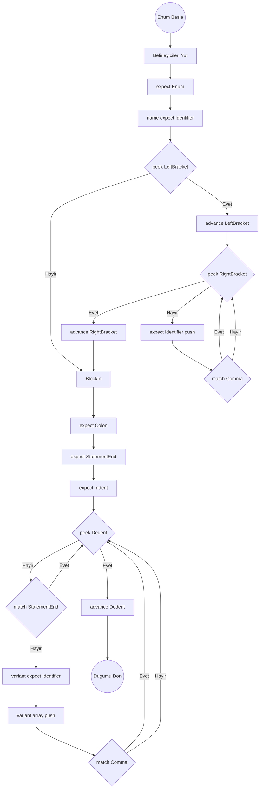
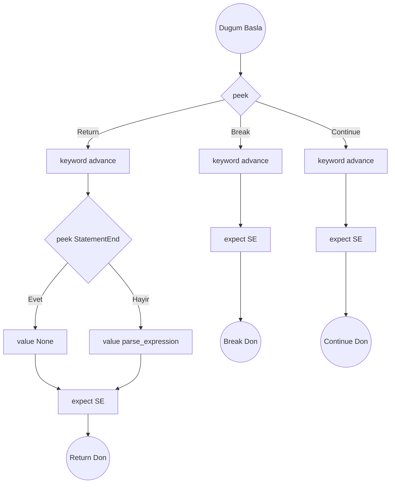

# Enum, Macro ve Çeşitli İfadeler Algoritmaları

Hedef Düğümler: `Stmt::EnumDecl`, `Stmt::MacroDecl`, `Stmt::DefineDecl`, `Stmt::Return`, `Stmt::Break`, `Stmt::Continue`

## Ayrıştırma Şeması: `parse_enum_decl()`

## parse_enum_decl()

1. Parser yönlendirmesinden (routing) gelen `modifiers` dizisini kullan.
2. `expect(Enum)`, `name = expect(Identifier)`.
3. Jenerikler: `type_params = []`. Eğer `match_token(LeftBracket)` gelirse:
   - Döngü: `while !check(RightBracket)`:
     - `type_params.push(expect(Identifier))`.
     - `match_token(Comma)`.
   - `expect(RightBracket)`.
4. Blok Girişi: `expect(Colon)`, `expect(StatementEnd)`, `expect(Indent)`.
5. `variants = []` oluştur.
6. Döngü: `while !check(Dedent)`:
   - Eğer `match_token(StatementEnd)` ise atla (continue).
   - `variants.push(expect(Identifier))`.
   - Elementler arası opsiyonel virgülleri atlamak için `match_token(Comma)` çağır.
7. `expect(Dedent)`, `Stmt::EnumDecl` döndür.

---

## parse_define_decl()

_(Define'lar `const` mantığıyla çalışır ama çok daha hafiftir: `define PI 3.14`)_

1. `expect(Define)`.
2. `name = expect(Identifier)`.
3. `value = parse_expression(0)` (Başında eşittir olmadan atama yapar).
4. `expect(StatementEnd)`.
5. `Stmt::DefineDecl` döndür.

---

## parse_macro_decl()

_(Makrolar kod-üretimi "code generation" blokları olarak çalışır: `macro loop count:`)_

1. `expect(Macro)`.
2. `name = expect(Identifier)`.
3. Parametreler: `params = []` oluştur. Döngü: `while !check(Colon)`:
   - `params.push(expect(Identifier))`.
4. `expect(Colon)`, `expect(StatementEnd)`.
5. `body = parse_block()`.
6. `Stmt::MacroDecl` döndür.

---

## Atlama / Sıçrama İfadeleri Şeması

## Algoritmalar

### parse_return_stmt()

1. `keyword = advance()`.
2. Eğer `!check(StatementEnd)` ise -> `value = Some(parse_expression(0))` ile dönecek değeri yakala.
3. Değilse -> `value = None`.
4. `expect(StatementEnd)`. `Stmt::Return` döndür.

### parse_break_stmt()

1. `keyword = advance()`.
2. `expect(StatementEnd)`. `Stmt::Break` döndür.

### parse_continue_stmt()

1. `keyword = advance()`.
2. `expect(StatementEnd)`. `Stmt::Continue` döndür.
